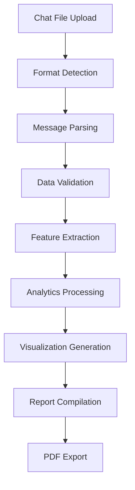

# CHATLYTICS — 

<div align="center">

**Transform your WhatsApp chat exports into powerful insights and beautiful reports**

[](https://python.org)
[](https://streamlit.io)
[](LICENSE)

</div>

---

## 📋 Table of Contents

- [Overview](#overview)
- [Features](#features)
- [Architecture](#architecture)
- [Installation](#installation)
- [Usage](#usage)
- [Screenshots & Demo](#screenshots--demo)
- [Technical Details](#technical-details)
- [File Structure](#file-structure)
- [API Reference](#api-reference)
- [Contributing](#contributing)
- [License](#license)

---

## 🎯 Overview

**CHATLYTICS** is a comprehensive WhatsApp chat analytics platform built with Streamlit that transforms exported WhatsApp chat files (.txt) into interactive insights, visualizations, and professional PDF reports. Whether you're analyzing group dynamics, personal conversations, or research data, CHATLYTICS provides deep insights into communication patterns, engagement metrics, and content analysis.

### Why CHATLYTICS?

- **🔍 Deep Analytics**: Comprehensive message statistics, timeline analysis, and user behavior insights
- **📊 Rich Visualizations**: Interactive charts, heatmaps, word clouds, and emoji analysis
- **📱 Multi-format Support**: Handles various WhatsApp export formats and timestamp patterns
- **📄 One-Click Reports**: Generate professional PDF reports instantly
- **🎨 Modern UI**: Beautiful, responsive interface with dark/light theme support
- **⚡ Real-time Processing**: Fast analysis with optimized data processing

---

## ✨ Features

### 📈 Analytics & Insights
- **Message Statistics**: Total messages, words, media posts, and shared links
- **Timeline Analysis**: Monthly and daily activity trends with interactive charts
- **Activity Patterns**: Busiest days, months, and weekly heatmaps
- **User Engagement**: Most active participants and contribution percentages
- **Content Analysis**: Word clouds, most common words, and emoji usage patterns

### 🎨 Visualizations
- **Interactive Charts**: Built with Matplotlib, Seaborn, and Altair
- **Activity Heatmaps**: Day vs. time period analysis
- **Timeline Graphs**: Message volume trends over time
- **Word Clouds**: Visual representation of conversation themes
- **Emoji Analytics**: Usage frequency and popularity charts

### 📄 Report Generation
- **Professional PDF Reports**: Comprehensive analysis with charts and tables
- **Executive Summary**: Key insights and statistics
- **Visual Charts**: All visualizations included in PDF format
- **One-Click Download**: Instant report generation and download

### 🔧 Technical Features
- **Multi-format Parsing**: Supports various WhatsApp export formats
- **Hinglish Support**: Optimized for Hindi-English mixed conversations
- **Responsive Design**: Works on desktop, tablet, and mobile devices
- **Theme Support**: Dark and light mode with smooth transitions
- **Error Handling**: Robust parsing with fallback mechanisms

---

## 🏗️ Architecture

CHATLYTICS follows a modular architecture with clear separation of concerns:

```
┌─────────────────┐    ┌─────────────────┐    ┌─────────────────┐
│   Frontend      │    │   Backend       │    │   Data Layer    │
│   (Streamlit)   │◄──►│   (Python)      │◄──►│   (Pandas)      │
└─────────────────┘    └─────────────────┘    └─────────────────┘
         │                       │                       │
         ▼                       ▼                       ▼
┌─────────────────┐    ┌─────────────────┐    ┌─────────────────┐
│   UI Components │    │   Analytics     │    │   Data Models   │
│   - Tabs        │    │   - Statistics  │    │   - DataFrames  │
│   - Charts      │    │   - Visuals     │    │   - Processing  │
│   - Reports     │    │   - Reports     │    │   - Validation  │
└─────────────────┘    └─────────────────┘    └─────────────────┘
```

### Core Components

1. **`app.py`**: Main Streamlit application with UI components and user interactions
2. **`preprocessor.py`**: Chat parsing engine with multi-format support
3. **`helper.py`**: Analytics engine with statistical calculations and visualizations
4. **`styles.css`**: Modern UI styling with theme support

---

## 🚀 Installation

### Prerequisites

- **Python 3.10+** (recommended: Python 3.11 or 3.12)
- **Git** (for cloning the repository)
- **Virtual Environment** (recommended)

### Step-by-Step Installation

#### 1. Clone the Repository

```bash
git clone https://github.com/yourusername/chatlytics.git
cd chatlytics
```

#### 2. Create Virtual Environment

**Windows (PowerShell):**
```powershell
python -m venv wca
.\wca\Scripts\Activate.ps1
```

**Windows (Command Prompt):**
```cmd
python -m venv wca
wca\Scripts\activate.bat
```

**macOS/Linux:**
```bash
python3 -m venv wca
source wca/bin/activate
```

#### 3. Install Dependencies

```bash
pip install -r requirements.txt
```

#### 4. Verify Installation

```bash
python -c "import streamlit, pandas, matplotlib, seaborn; print('All dependencies installed successfully!')"
```

### Alternative Installation Methods

#### Using Conda

```bash
conda create -n chatlytics python=3.11
conda activate chatlytics
pip install -r requirements.txt
```

#### Using Poetry

```bash
poetry install
poetry shell
```

---

## 🎮 Usage

### 1. Start the Application

**Windows:**
```powershell
.\wca\Scripts\streamlit.exe run code/app.py --server.headless true --server.port 8501
```

**macOS/Linux:**
```bash
streamlit run code/app.py --server.headless true --server.port 8501
```

### 2. Access the Application

Open your web browser and navigate to:
```
http://localhost:8501
```

### 3. Upload and Analyze

1. **Upload Chat File**: Click "Upload exported chat (.txt)" and select your WhatsApp export
2. **Select Analysis Scope**: Choose "Overall" for group analysis or select a specific participant
3. **Explore Insights**: Navigate through the tabs to explore different analytics
4. **Generate Report**: Scroll to the Report section and click "Download Full Report as PDF"

### 4. Understanding the Interface

#### Navigation Tabs

- **📊 Overview**: Key metrics and statistics
- **📈 Timeline**: Message trends over time
- **🔥 Activity**: Busiest periods and patterns
- **👥 Users**: Participant analysis (Overall view only)
- **☁️ Words**: Word clouds and common terms
- **😊 Emojis**: Emoji usage analysis

#### Key Features

- **Real-time Analysis**: Results update automatically when you change selections
- **Interactive Charts**: Hover over charts for detailed information
- **Responsive Design**: Works on all screen sizes
- **Export Options**: Download comprehensive PDF reports

---

## 📸 Screenshots & Demo

### 🖼️ Application Screenshots

#### Main Dashboard

*Clean, modern interface with key metrics and navigation*

#### Timeline Analysis

*Interactive charts showing message trends over time*

#### Activity Heatmap

*Visual representation of when conversations are most active*

#### Word Cloud

*Beautiful word cloud showing conversation themes*

#### Emoji Analysis

*Comprehensive emoji usage statistics and charts*

#### PDF Report

*Professional PDF report with all analytics and visualizations*

### 🎥 Demo Video

[](https://www.youtube.com/watch?v=YOUR_VIDEO_ID)

**Watch the complete demo**: [CHATLYTICS Demo Video](https://www.youtube.com/watch?v=YOUR_VIDEO_ID)

*This video demonstrates the complete workflow from chat upload to report generation*

### 📊 Sample Outputs

#### Sample Statistics
```
📊 Chat Analysis Results:
├── Total Messages: 15,847
├── Total Words: 89,234
├── Media Messages: 1,234
├── Links Shared: 456
├── Date Range: 2023-01-01 to 2024-01-15
└── Most Active User: John Doe (23.4%)
```

#### Sample Timeline Data
```
📈 Monthly Activity:
├── January 2024: 2,847 messages
├── December 2023: 2,234 messages
├── November 2023: 1,987 messages
└── October 2023: 1,756 messages
```

---

## 🔧 Technical Details

### Supported Chat Formats

CHATLYTICS supports multiple WhatsApp export formats:

1. **Standard Format**: `DD/MM/YYYY, HH:MM - User: Message`
2. **Alternative Format**: `DD/MM/YYYY, HH:MM User: Message`
3. **Dash Format**: `DD-MM-YYYY, HH:MM - User: Message`
4. **Dot Format**: `DD.MM.YYYY, HH:MM - User: Message`
5. **Bracket Format**: `[DD/MM/YYYY, HH:MM:SS] User: Message`

### Data Processing Pipeline



### Performance Optimizations

- **Lazy Loading**: Charts and visualizations are generated on-demand
- **Caching**: Session state management for improved performance
- **Memory Management**: Efficient DataFrame operations with pandas
- **Parallel Processing**: Multi-threaded operations where applicable

### Browser Compatibility

- ✅ Chrome 90+
- ✅ Firefox 88+
- ✅ Safari 14+
- ✅ Edge 90+
- ✅ Mobile browsers (iOS Safari, Chrome Mobile)

---

## 📁 File Structure

```
chatlytics/
├── 📁 code/                          # Main application code
│   ├── 📄 app.py                     # Streamlit main application
│   ├── 📄 helper.py                  # Analytics and visualization functions
│   ├── 📄 preprocessor.py            # Chat parsing and data processing
│   ├── 📄 styles.css                 # UI styling and themes
│   └── 📄 stop_hinglish.txt          # Stop words for Hinglish text
├── 📁 docs/                          # Documentation and assets
│   ├── 📁 screenshots/               # Application screenshots
│   ├── 📁 samples/                   # Sample chat files
│   └── 📄 api.md                     # API documentation
├── 📁 wca/                          # Virtual environment (Windows)
│   ├── 📁 Scripts/                  # Python executables
│   ├── 📁 Lib/                      # Python libraries
│   └── 📄 pyvenv.cfg                # Virtual environment config
├── 📄 requirements.txt               # Python dependencies
├── 📄 README.md                      # This file
├── 📄 LICENSE                        # MIT License
└── 📄 .gitignore                     # Git ignore rules
```

### Key Files Explained

- **`app.py`**: Main Streamlit application (543 lines)
  - UI components and user interactions
  - Chart rendering and report generation
  - Session state management

- **`helper.py`**: Analytics engine (242 lines)
  - Statistical calculations
  - Visualization functions
  - Data aggregation methods

- **`preprocessor.py`**: Data processing (186 lines)
  - Chat format detection
  - Message parsing and validation
  - Feature extraction

- **`styles.css`**: UI styling (583 lines)
  - Modern CSS with theme support
  - Responsive design
  - Animation and transitions

---

## 📚 API Reference

### Core Functions

#### `preprocessor.preprocess(data: str) -> pd.DataFrame`
Parses raw WhatsApp chat data into a structured DataFrame.

**Parameters:**
- `data` (str): Raw chat text content

**Returns:**
- `pd.DataFrame`: Processed chat data with columns:
  - `date`: Timestamp of message
  - `user`: Sender name
  - `message`: Message content
  - `only_date`: Date without time
  - `year`, `month`, `day_name`, `hour`: Extracted time components
  - `period`: Time period (e.g., "12-13")

#### `helper.fetch_stats(selected_user: str, df: pd.DataFrame) -> tuple`
Calculates basic statistics for messages.

**Parameters:**
- `selected_user` (str): User to analyze ("Overall" for all users)
- `df` (pd.DataFrame): Processed chat data

**Returns:**
- `tuple`: (num_messages, num_words, num_media, num_links)

#### `helper.create_wordcloud(selected_user: str, df: pd.DataFrame) -> WordCloud`
Generates a word cloud visualization.

**Parameters:**
- `selected_user` (str): User to analyze
- `df` (pd.DataFrame): Processed chat data

**Returns:**
- `WordCloud`: Word cloud object for visualization

#### `helper.emoji_helper(selected_user: str, df: pd.DataFrame) -> pd.DataFrame`
Analyzes emoji usage in messages.

**Parameters:**
- `selected_user` (str): User to analyze
- `df` (pd.DataFrame): Processed chat data

**Returns:**
- `pd.DataFrame`: Emoji usage statistics

### Visualization Functions

#### `helper.monthly_timeline(selected_user: str, df: pd.DataFrame) -> pd.DataFrame`
Creates monthly message timeline data.

#### `helper.daily_timeline(selected_user: str, df: pd.DataFrame) -> pd.DataFrame`
Creates daily message timeline data.

#### `helper.activity_heatmap(selected_user: str, df: pd.DataFrame) -> pd.DataFrame`
Generates activity heatmap data (day vs. time period).

#### `helper.time_activity_user_grid(selected_user: str, df: pd.DataFrame) -> pd.DataFrame`
Creates detailed time-based activity grid for Altair visualizations.

---

## 🤝 Contributing

We welcome contributions to CHATLYTICS! Here's how you can help:

### Ways to Contribute

1. **🐛 Bug Reports**: Report issues and bugs
2. **💡 Feature Requests**: Suggest new features
3. **📝 Documentation**: Improve documentation
4. **🔧 Code Contributions**: Submit pull requests
5. **🎨 UI/UX**: Design improvements
6. **🧪 Testing**: Test on different platforms

### Development Setup

1. **Fork the repository**
2. **Create a feature branch**:
   ```bash
   git checkout -b feature/amazing-feature
   ```
3. **Make your changes**
4. **Test thoroughly**
5. **Commit your changes**:
   ```bash
   git commit -m "Add amazing feature"
   ```
6. **Push to the branch**:
   ```bash
   git push origin feature/amazing-feature
   ```
7. **Open a Pull Request**

### Code Style Guidelines

- Follow PEP 8 for Python code
- Use meaningful variable and function names
- Add docstrings for all functions
- Include type hints where appropriate
- Write tests for new features

### Testing

```bash
# Run basic tests
python -m pytest tests/

# Test specific functionality
python -c "import preprocessor; print('Preprocessor OK')"
python -c "import helper; print('Helper OK')"
```

---

## 📄 License

This project is licensed under the MIT License - see the [LICENSE](LICENSE) file for details.

```
MIT License

Copyright (c) 2025 Rohan Mushan

Permission is hereby granted, free of charge, to any person obtaining a copy
of this software and associated documentation files (the "Software"), to deal
in the Software without restriction, including without limitation the rights
to use, copy, modify, merge, publish, distribute, sublicense, and/or sell
copies of the Software, and to permit persons to whom the Software is
furnished to do so, subject to the following conditions:

The above copyright notice and this permission notice shall be included in all
copies or substantial portions of the Software.

THE SOFTWARE IS PROVIDED "AS IS", WITHOUT WARRANTY OF ANY KIND, EXPRESS OR
IMPLIED, INCLUDING BUT NOT LIMITED TO THE WARRANTIES OF MERCHANTABILITY,
FITNESS FOR A PARTICULAR PURPOSE AND NONINFRINGEMENT. IN NO EVENT SHALL THE
AUTHORS OR COPYRIGHT HOLDERS BE LIABLE FOR ANY CLAIM, DAMAGES OR OTHER
LIABILITY, WHETHER IN AN ACTION OF CONTRACT, TORT OR OTHERWISE, ARISING FROM,
OUT OF OR IN CONNECTION WITH THE SOFTWARE OR THE USE OR OTHER DEALINGS IN THE
SOFTWARE.
```

---

## 🙏 Acknowledgments

- **Streamlit** - For the amazing web framework
- **Pandas** - For powerful data manipulation
- **Matplotlib & Seaborn** - For beautiful visualizations
- **Altair** - For interactive charts
- **ReportLab** - For PDF generation
- **WordCloud** - For word cloud generation
- **Emoji** - For emoji detection and analysis

---

## 📞 Support & Contact

- **Issues**: [GitHub Issues](https://github.com/yourusername/chatlytics/issues)
- **Discussions**: [GitHub Discussions](https://github.com/yourusername/chatlytics/discussions)
- **Email**: [your.email@example.com](mailto:your.email@example.com)

---

<div align="center">

**Made with ❤️ by [Rohan Mushan](https://github.com/yourusername)**

[](https://github.com/yourusername)
[](https://linkedin.com/in/yourusername)
[](https://twitter.com/yourusername)

**⭐ Star this repository if you found it helpful!**

</div>